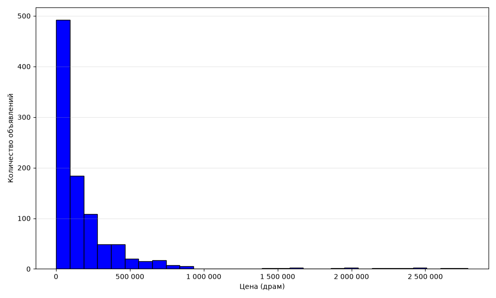
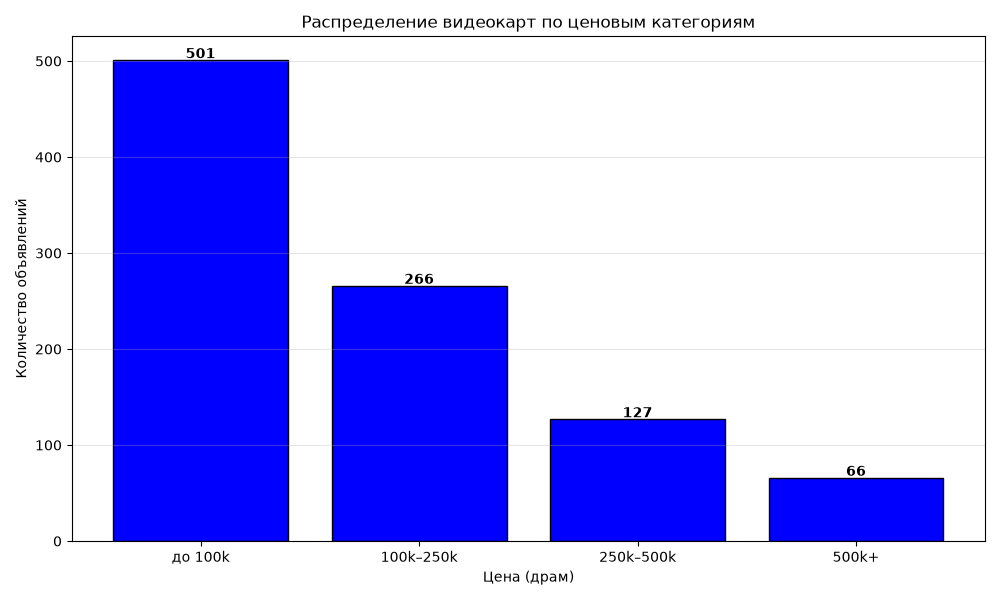
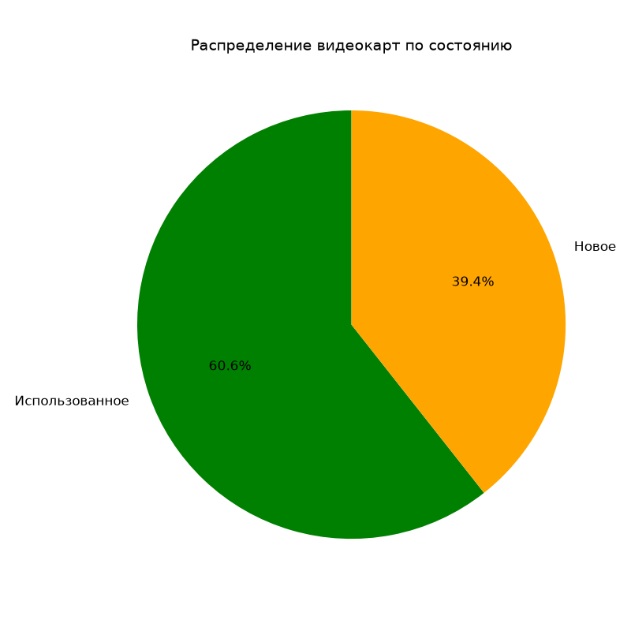

# list.am GPU Parser

Парсер объявлений о видеокартах с армянской доски объявлений [list.am](https://www.list.am/ru/category/452). Собирает название, цену, состояние, локацию и ссылку на объявление, сохраняет в CSV. Проводит анализ собранных данных.

## 🎯 Что делает

### Парсинг (main.py)

- Открывает категорию «Видеокарты» на list.am
- Проходит несколько страниц пагинации
- Собирает данные с каждой карточки товара:
  - **title** — название модели
  - **price** — цена в драмах
  - **condition** — состояние (Новое / Использованное)
  - **location** — город/район продавца
  - **link** — ссылка на объявление
- Удаляет дубликаты объявлений
- Сохраняет всё в `list.csv`

### Анализ объявлений (analysis.py)

- Загружает `list.csv` через pandas
- Парсит цены и конвертирует валюты ($, €, ₽ → ֏)
- Считает статистику:
  - Средняя, медианная, мин/макс цена
  - Топ-10 самых дорогих и дешёвых видеокарт
  - Распределение по локациям
  - Распределение по состоянию
- Строит графики через matplotlib:
  - Гистограмма распределения цен
  - Диаграмма по ценовым диапазонам
- Сохраняет графики в `charts/`

## 🛠 Стек

- **Python 3.12**
- **Selenium** — автоматизация браузера, обход динамической загрузки
- **Pandas** — анализ данных
- **matplotlib** — визуализация данных

## 🚀 Запуск

1. Клонировать репозиторий:
   ```bash
   git clone https://github.com/Ee1Tea/parser-list-am.git
   cd parser-list-am    
2. Установить зависимости:
   ```bash
   pip install -r requirements.txt
3. Запустить парсер:
   ```bash
   python main.py
Результат — файл `list.csv` в корне проекта

4. Запустить анализ:
   ```bash
   python analysis.py
Результат - графики в папке `charts/` и статистика в консоли

## ⚙️ Настройки парсера
В `main.py` есть параметры в начале файла:

- `PAGES` — сколько страниц парсить (по умолчанию 3)
- `DELAY` — пауза между страницами в секундах (по умолчанию 5)
- `OUTPUT` — имя выходного файла (по умолчанию `list.csv`)

## ⚙️ Настройки анализа
В `analisys.py` есть параметры в начале файла:

- `INPUT` — имя входного файла (по умолчанию `list.csv`)
- `CHARTS_DIR` — имя папки, в которую сохраняются изображения графиков (по умолчанию `charts`)
- `TOP_N` - количество выводимых объявлений в "Топ дорогих/дешевых" (по умолчанию 10)

## 💱 Конвертация валют

Цены в объявлениях могут быть указаны в разных валютах. Скрипт анализа автоматически конвертирует их в армянские драмы по фиксированному (на 21.09.2026) курсу:

- `$1 = 363.44 ֏`
- `€1 = 417.05 ֏`
- `₽1 = 4.31 ֏`

Курс задаётся в начале `analysis.py` и может быть обновлён.
## 🛡 Обход Cloudflare
Сервис list.am использует Cloudflare для защиты от ботов. В парсере применены:

- Отключение флага navigator.webdriver
- Скрытие признаков автоматизации (excludeSwitches, useAutomationExtension)
- Задержки между запросами, имитирующие поведение пользователя

## 📊 Пример вывода `list.csv`

| title | price | condition | location | link |
|-------|-------|-----------|----------|------|
| MSI GeForce RTX5070Ti 16G GAMING TRIO OC | 479,000֏ | Новое | Кентрон | https://www.list.am/ru/item/24236778 |
| EVGA RTX 3090 ftw3 ultra | 425,000֏ | Использованное | Малатия-Себастия | https://www.list.am/ru/item/24242107 |

## 📊 Пример вывода `price_hist.png`


## 📊 Пример вывода `price_ranges.png`


## 📊 Пример вывода `condition_pie.png`


## 🗺 Планы по развитию

- [x] Базовый парсер на Selenium с обходом Cloudflare
- [x] Пагинация (сбор с нескольких страниц)
- [x] Дедупликация объявлений
- [x] Анализ данных через pandas
- [x] Визуализация через matplotlib
- [ ] Уведомления при изменении цен